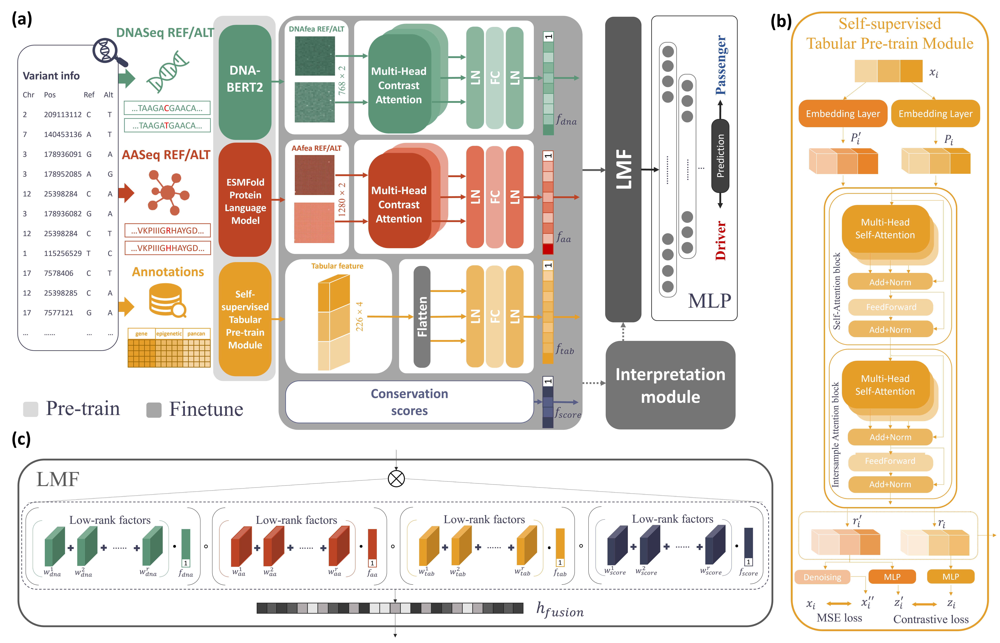

# **ModVAR: A Multimodal Framework for Comprehensive Driver Variant Prediction in Cancer**

## Overview

---

ModVAR is an innovative multimodal model that integrates DNA sequences, protein tertiary structures, and cancer omics data to predict driver variants with exceptional precision.Leveraging pre-trained models DNAbert2 and ESMFold, combined with a novel self-supervised strategy for omics data, ModVAR consistently outperforms 14 leading prediction methods. It achieves an outstanding AUROC of 0.985 in clinical benchmarks and 0.952 in experimental assay-related benchmarks, underscoring its effectiveness in identifying both clinically and experimentally validated variants. ModVAR also excels in predicting cancer indels, with an AUROC of 0.901, and demonstrates remarkable generalization with an AUROC of 0.981 for non-cancer disease variants. These results underscore ModVAR's robustness and versatility, positioning it as a powerful tool in genomics and precision medicine. Additionally, its application to COSMIC has generated a publicly available resource of 3,971,946 annotated variants, marking a significant advancement in cancer research and personalized therapy.

## Installation

---

Clone this repository and cd into it as below.

~~~
git clone https://github.com/kiroro100700/ModVAR.git

cd ModVAR
~~~

Prepare the environment,the `requirements.txt` is based on python3.7.1.
~~~
#You can use conda to create a new environment

conda create --name new_env python=3.7.1
conda activate new_env
~~~
~~~
pip install -r requirements.txt
~~~

Note that the command should be executed in the directory containing the requirements.txt file.

## Usage

---

 This repository mainly support 3 different workflow:

- Train and evaluate your own ModVAR model with chosen dataset.
- Evaluate a trained ModVAR model on specific dataset and access scoreing result in an output file.
- Extracting DNA pretraining embeded features.(protein and tabular cancer-omics extraction(pretraining) are not included in this repository due to large memory and computing comsumption)

First you need to cd into the code directory to call the command below.

~~~
cd code
~~~

### Train and  Eval

Example:

~~~
python task.py -m train_eval -v val_23t1 -model ModVAR_default
~~~

Options:

- -m:Run mode. Specifies which task to execute.
- -v:Validation dataset.Options include `val_23t1`, `val_23t2`, `val_23t3`, `val_mutation_cluster`, `val_In_vivo`, and `val_In_vitro`.
- -model:The trained model will be saved to `/data/{model_name}/{model_name}_each_epoch`.
- -t:Training dataset.The default value is the dataset used in our study.
- -tab:Pretrained tabular model.Default value is "saint_fn.pth".
- -b:Batch size.
- -e:Number of training epochs..

Description:

This command allows you to train a ModVAR model on your own and save the newly trained model for further evaluation. The default training settings use the hyperparameters from our study, but the results may vary slightly due to differences in hardware and system configurations.

### Evaluation

Example:

~~~
python task.py -m eval -v val_23t1 -o test
~~~

Options:

- -m:Run mode. Specifies which task to execute.
- -v:Validation dataset.Options include `val_23t1`, `val_23t2`, `val_23t3`, `val_mutation_cluster`, `val_In_vivo`, and `val_In_vitro`.
- -tab:Pretrained tabular model.Default value is "saint_fn.pth".
- -o:[optional]Output file name.If set, then the result will be saved to `output/{output_file}.tsv`
- -model:[optional]The model to be evaluated,default value is `ModVAR.pth`. If you want to evaluate a model trained by the previous step,must include the directory: `{model_nam}/{model_name}_chosen_epoch.pth`.

Description:

This command allows you to evaluate a ModVAR model on selected validation set. If the `-o` option is set,then the prediction result will be saved to an output file.

### Feature extraction

Example:

~~~
python task.py -m extract_dna_fea -file val_In_vivo
~~~

Options:

- -m:Run mode. Specifies which task to execute.
- -file:The file name of raw dna data file.You can use the same options as "Validation dataset", while those features have already been extracted and saved at `/data/fea/dna`

Description

This command allows you to extract DNA pretraining features from raw DNA sequence data. To extract DNA pretraining features from your own dataset, please follow the data format in the `{val_name}_dna_seq.txt` file. This file should have three columns separated by `\t`: the first column for the reference DNA sequence, the second column for the alternative DNA sequence, and the third column for the mutation label (which is optional).

